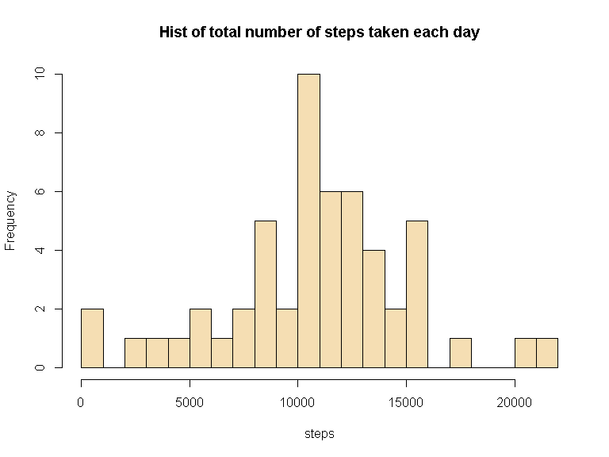
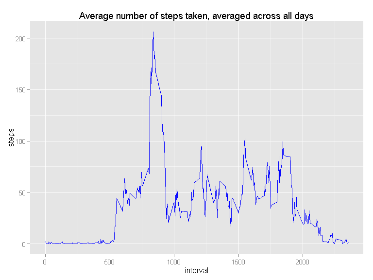
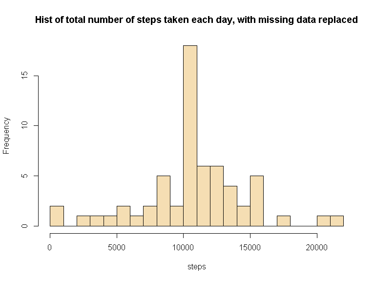

# Reproducible Research: Peer Assessment 1


## Loading and preprocessing the data


```r
  activity <-  unzip("./activity.zip")
  activitydata <- read.csv(activity)
  summary(activitydata)
```

```
##      steps                date          interval     
##  Min.   :  0.00   2012-10-01:  288   Min.   :   0.0  
##  1st Qu.:  0.00   2012-10-02:  288   1st Qu.: 588.8  
##  Median :  0.00   2012-10-03:  288   Median :1177.5  
##  Mean   : 37.38   2012-10-04:  288   Mean   :1177.5  
##  3rd Qu.: 12.00   2012-10-05:  288   3rd Qu.:1766.2  
##  Max.   :806.00   2012-10-06:  288   Max.   :2355.0  
##  NA's   :2304     (Other)   :15840
```


## What is mean total number of steps taken per day?

#### The histogram shows the total number of steps taken each day


```r
  stepsperday <- aggregate(steps~date,activitydata,sum)
  hist(stepsperday$steps,breaks=20,main="Hist of total number of steps taken each day",col="wheat",xlab="steps")
```

 


#### The mean of total total number of steps taken per day is


```r
  mean(stepsperday$steps)
```

```
## [1] 10766.19
```

####The median of total total number of steps taken per day is


```r
  median(stepsperday$steps)
```

```
## [1] 10765
```

## What is the average daily activity pattern?  

####This a time series plot of the 5-minute interval (x-axis) and the average number of steps taken, averaged across all days (y-axis)


```r
  stepsperinterval <- aggregate(steps~interval,activitydata,mean)
  library(ggplot2)
```

```
## Warning: package 'ggplot2' was built under R version 3.1.3
```

```r
  g <- ggplot(stepsperinterval,aes(interval,steps))
  g+geom_line(size=0.5,color="blue")+labs(x="interval")+labs(y="steps")+labs(title="Average number of steps taken, averaged across all days")
```

 

```r
  max_value <- max(stepsperinterval$steps)
  stepsperinterval[stepsperinterval$steps == max_value, ]
```

```
##     interval    steps
## 104      835 206.1698
```

###The maximum number of step is  


```r
  max_value <- max(stepsperinterval$steps)
  print(max_value) 
```

[1] 206.1698

###that corresponds to the interval  


```r
  max_interval <- stepsperinterval[stepsperinterval$steps == max_value, ]
  max_interval$interval
```

```
## [1] 835
```

## Imputing missing values

#### The number missing values NA of the activity dataframe are 


```r
  for (Var in names(activitydata)) {
    missing <- sum(is.na(activitydata[,Var]))
    if (missing > 0) {
        print(missing)
    }
  }
```

```
## [1] 2304
```

#### I create a new dataset that is equal to the original one but with the missing data filled in. 
#### In the following code I replace the NA VALUE of steps variable, with the mean for that day


```r
  df_impute <- activitydata
  index <- is.na(df_impute$steps)
  df_ign <- subset(activitydata,!is.na(activitydata$steps))
  int_avg <- tapply(df_ign$steps, df_ign$interval, mean, na.rm=TRUE, simplify=T)
  df_impute$steps[index] <- int_avg[as.character(df_impute$interval[index])]
```
  

#### The following histogram shows the distribution of the total number of steps taken each day  


```r
  stepsperday_impute <- aggregate(steps~date,df_impute,sum)
  hist(stepsperday_impute$steps,breaks=20,main="Hist of total number of steps taken each day, with missing data replaced",col="wheat",xlab="steps")
```

 
  
#### The mean and median total number of steps taken per day are  


```r
  mean(stepsperday_impute$steps)
```

```
## [1] 10766.19
```


```r
  median(stepsperday_impute$steps)
```

```
## [1] 10766.19
```

####The mean of the dataframe with imputed values is the same of the original data frame, while the median of the data frame with imputed value is different rom the original one, it has the same value of the mean. this is due to the fact that we replaced the NA values with the mean of values for the same day.


